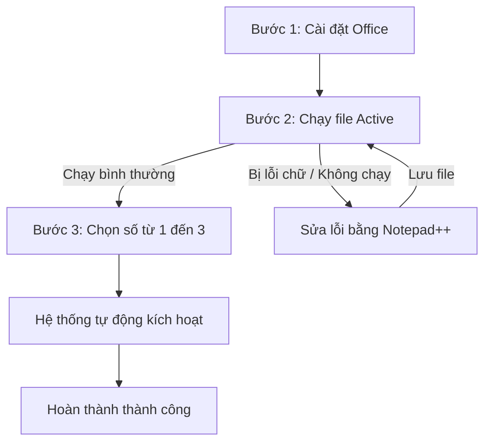

# Hướng Dẫn Kích Hoạt Windows Pro & Microsoft Office (Mọi Phiên Bản)

Tài liệu này hướng dẫn chi tiết các bước cài đặt bộ ứng dụng văn phòng Microsoft Office và kích hoạt bản quyền Windows/Office nhanh chóng, an toàn.

---

## 📋 Quy Trình Thực Hiện Nhanh

---

## 🛠️ Các Bước Cài Đặt Và Kích Hoạt

### Bước 1: Cài đặt Microsoft Office
* Mở thư mục cài đặt của bạn.
* Khởi chạy **một trong hai** file: `Office365Setup` hoặc `OfficeSetup` để bắt đầu quá trình cài đặt tự động.

### Bước 2: Chạy công cụ kích hoạt
* Click đúp chuột (hoặc nhấn chuột phải chọn *Run as administrator*) vào file **Active**.
* **Lưu ý:** Nếu file báo lỗi, không hiển thị menu hoặc tắt đột ngột, vui lòng bỏ qua bước này và xem ngay phần **[⚠️ Xử lý sự cố khi file Active bị lỗi](#-xu-ly-su-co-khi-file-active-bi-loi)** ở bên dưới.

### Bước 3: Lựa chọn phương thức kích hoạt
Khi màn hình công cụ xuất hiện, bạn nhấn phím số trên bàn phím tương ứng với nhu cầu của mình:
* **Phím 1:** Chỉ kích hoạt Windows.
* **Phím 2:** Chỉ kích hoạt Office.
* **Phím 3:** Kích hoạt cả Windows và Office (Khuyên dùng).

### Bước 4: Hoàn thành
* Chờ đợi trong giây lát để hệ thống tự động cập nhật dữ liệu.
* Khi màn hình hiển thị thông báo thành công (như hình dưới), bạn có thể tắt công cụ và sử dụng phần mềm bình thường.

🎉 *Chúc bạn thực hiện thành công!*

---

## ⚠️ Xử Lý Sự Cố Khi File Active Bị Lỗi

Nếu file kích hoạt hiển thị sai ký tự hoặc không thể chạy do lỗi định dạng dòng (EOL) giữa các hệ điều hành, hãy xử lý theo các bước sau:

1. **Tải công cụ hỗ trợ:** Truy cập trang chủ [Notepad++ Downloads](https://notepad-plus-plus.org) để tải và cài đặt phiên bản mới nhất của phần mềm Notepad++.
2. **Mở file chỉnh sửa:** Click chuột phải vào file **Active** -> Chọn **Edit with Notepad++**.
   
3. **Chuyển đổi định dạng dòng:** 
   * Trên thanh menu của Notepad++, chọn tab **Edit**.
   * Di chuột vào mục **EOL Conversion**.
   * Tích chọn **Windows (CR LF)**.
   
4. **Lưu và chạy lại:** Nhấn tổ hợp phím `Ctrl + S` để lưu lại file. Sau đó quay lại làm tiếp từ **[Bước 2](#bước-2-chạy-công-cụ-kích-hoạt)**.
